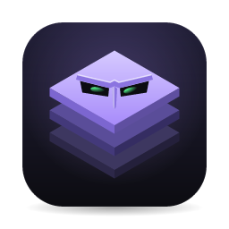

<p align="center">
  
</p>

<h1 align="center">Villain Layer</h1>

<p align="center">
  <strong>A macOS app for coding agents, where no agent holds your credentials</strong><br>
  By <a href="https://codevillain.eu">Villain Studios</a> · Tools for shipping with AI
</p>

<p align="center">
  <a href="https://github.com/Villain-Studios/villain-layer/releases/latest">Download</a> ·
  <a href="https://github.com/Villain-Studios/villain-layer/blob/main/docs/features.md">Features</a> ·
  <a href="https://github.com/Villain-Studios/villain-layer/blob/main/AGENTS.md">Contributing</a>
</p>

---

## Problem

Coding agents need context: tickets, repositories, credentials for Jira and GitHub. They need isolation: branches that don't collide, worktrees that don't touch your working copy. And you need visibility: which agents are working, which are waiting on you, what they've changed.

Most solutions either give agents full access to your credentials, or make you manage branches, worktrees, and context files manually.

## Local-first

Everything runs on your machine. The MCP server agents talk to runs on `127.0.0.1` and never leaves the machine—even when phone access is enabled. Agents never hold your credentials: they request actions through the MCP server, you see what they want, and the app executes it only after confirmation. No logs or telemetry are sent to external servers.

## Demo

[](https://github.com/Villain-Studios/villain-layer/releases/latest)

*Video demo and animated walkthrough: coming soon*

## What it does

**Task isolation**: One ticket becomes one task across multiple repositories. Each task gets its own branch name, its own folder, and a git worktree per repo. Multiple tasks and multiple agents run side by side without touching each other or your clones.

**Verification workflow**—how you verify AI output:

1. **Spec-Builds**: A task can start with spec generation—requirements, design, implementation tasks—drafted from the ticket before any agent writes code. Each spec file is approved individually and committed to the branch. Agents work from the spec.

2. **Agent flexibility**: Run agents as terminal sessions (Claude Code, Copilot CLI, Gemini CLI, OpenCode) or over ACP (Zed Agent Client Protocol) for conversation-style interaction with visible tool calls and permission prompts.

3. **Automated verification loop**: Set a check command per repository (`bun run check`, `cargo test`, `npm run lint`). Hit the loop button, and the agent iterates: work → run checks → if they fail, the agent gets the output and fixes it → repeat until tests pass or max rounds reached (default 5, configurable up to 20). No manual copy-paste of test failures.

4. **Built-in browser**: Agents can navigate a Chrome-based browser through MCP tools. They can start dev servers, test pages on localhost, request access to staging sites, and sign in with saved credentials. You watch what they're doing in real time.

5. **Spec checking**: Check the branch against the approved spec, requirement by requirement: met, not met or unclear, with the files and lines that show it.

**No credential sharing**: Agents connect to Jira, GitHub, and Slack through the app's own MCP server. They request actions; the app shows you what they want and executes it only after confirmation. Your tokens never touch the agent's environment.

**Review workflow**: A unified diff across all of a task's repositories, with line-level notes you can send directly to an agent. Commit from the app. Update branches by merge or rebase. Push with proper force-with-lease.

**Pull request management**: Open one PR per repo from the app. See check status and review comments. Hand failing CI logs and review threads to an agent in one action. When PRs merge, one command cleans up: worktrees, branches, and the ticket.

**Attention tracking**: Dock badge counts agents waiting on you. Banner notifications for new review requests and tickets. Each agent's status dot updates in real time as it reports working, asking, or done.

**Themes**: Dark, Light, Tokyo Night, Cursor Dark/Light, Ayu Dark/Light, or match system appearance. Applies to the app and any paired phone immediately.

Full feature list with requirements in [`docs/features.md`](docs/features.md).

## Stack

- **macOS desktop app**: Tauri 2 (Rust backend, React 19 frontend)
- **Terminals**: xterm.js with portable-pty
- **Agent protocol**: ACP (Agent Client Protocol) for compatible agents; terminal passthrough otherwise
- **MCP server**: Built-in Model Context Protocol server for agent tool calls
- **Git**: libgit2-free; runs git directly with strict safety flags
- **Integrations**: Jira Cloud REST API, GitHub REST + GraphQL, Slack Web API
- **Secrets**: macOS Keychain via the `keyring` crate
- **Frontend state**: Zustand, updated by events from the backend
- **License**: MIT OR Apache-2.0 (dual-licensed)

See [`docs/architecture.md`](docs/architecture.md) for details.

## Install

### Homebrew (recommended)

```bash
brew tap villain-studios/tap
brew trust --cask villain-studios/tap/villain-layer
brew install --cask villain-layer
```

Updates: `brew upgrade --cask villain-layer`. Quit the app first, and run it from a terminal outside the app—replacing the bundle while it's running kills it and every agent in it, so the cask refuses to.

### Direct download

Download the `.dmg` from the [latest release](https://github.com/Villain-Studios/villain-layer/releases/latest). Runs on Apple Silicon and Intel.

macOS will block the first launch with "Apple could not verify…" because releases aren't notarized. Open System Settings → Privacy & Security → **Open Anyway**. Once is enough.

### Requirements

- macOS 26 or later
- git (from Xcode Command Line Tools: `xcode-select --install`)
- At least one agent CLI installed and authenticated: `claude`, `copilot`, `gemini`, or `opencode`
- Optional: Jira Cloud, GitHub, Slack

### Build from source

```bash
git clone https://github.com/Villain-Studios/villain-layer.git
cd villain-layer
bun install
bun run release:mac
```

Installs to `/Applications/Villain Layer.app`. A self-built copy opens without the security warning.

**Development requirements**: Rust (stable) and [Bun](https://bun.sh).

## Screenshots

<!-- TODO: Add screenshots showing:
  - Task list with agent status indicators
  - Spec tab with requirements and approval workflow
  - Terminal view of an agent at work
  - ACP conversation view
  - Diff view with inline notes
  - PR tab with review comments and CI status
  - Settings showing credential configuration
-->

*Screenshots will be added in a future update. See [releases](https://github.com/Villain-Studios/villain-layer/releases) for the current state.*

## Getting started

1. **Add repositories**: Repos → *Add repositories* → *Scan a folder* (e.g., `~/code`). Select the repos you work in. Optionally group them.

2. **Set check commands** (optional but recommended): In the Repos view, set a check command for each repo (e.g., `bun run check`, `cargo test`, `npm run lint`). These let you use the automated verification loop.

3. **Configure integrations** (gear icon, top right):
   - **Jira**: Site URL, email, API token (from [id.atlassian.com](https://id.atlassian.com) → Security → API tokens)
   - **GitHub**: Personal access token with `repo` scope. For Enterprise, set the API URL to `https://<host>/api/v3`
   - **Slack** (optional): Create an app from the manifest shown in Settings, install it, paste the bot token (`xoxb-…`)
   - **Browser** (optional): Add sites agents can access beyond localhost (e.g., staging environments). Save sign-in credentials for sites that need authentication.

4. **Start a task**: Tickets → pick a ticket → *Start work*. Choose repositories, base branch, and agent. Optionally choose *Write a spec first* to draft a specification before coding begins.

5. **Work with the agent**: In the task's Agents tab, the status dot and badge tell you when the agent needs you. For terminal agents, you interact through the terminal. For ACP agents, you see a conversation view with tool calls and permission prompts.

6. **Use the verification loop** (optional): Once the agent has made progress, click the loop button in the pane bar. Set max rounds (default 5). The agent will iterate automatically: run checks → if they fail, read failures → fix → repeat until passing or rounds exhausted.

7. **Test in the browser** (optional): If the agent started a dev server, open the task's Browser tab. The agent can navigate to `localhost`, interact with pages, and you can watch what it's doing. Grant additional sites as needed.

8. **Review and commit**: Diff tab shows changes across all repos. Click a line number to leave a note, then *Send to agent*. Commit when ready.

9. **Open PRs**: Pull requests tab → *Open pull request*. When reviews arrive, *Feedback → agent* hands over threads and failing checks.

10. **Finish**: When PRs merge, right-click the task → *Finish task* to clean up worktrees, branches, and update the ticket.

## What it changes on your machine

- **Task folders**: `~/.villain-worktrees/<task-id>/` (configurable). Each holds one worktree per repo plus context files for agents.
- **Repository copies**: `~/.villain-worktrees/.repos/`. Worktrees come from these, not your clones, so you can move or delete your clones without breaking tasks. Hard-links git objects to save disk space.
- **Specs**: Either `specs/<task-id>/` in the worktree (committed to the branch), or `~/Library/Application Support/eu.codevillain.villain-layer/specs/<repo>/<task-id>/` when in-tree specs are disabled.
- **Browser profile**: `~/Library/Application Support/eu.codevillain.villain-layer/browser/`. Chrome/Chromium profile for the built-in browser. Keeps cookies, saved sign-ins, and page storage separate from your personal browser.
- **Settings**: `~/Library/Application Support/eu.codevillain.villain-layer/config.json`
- **Secrets**: macOS Keychain (item: `eu.codevillain.villain-layer`). Includes integration tokens and browser sign-in passwords.
- **Claude Code trust**: `~/.claude.json` (only when *Trust the folders this app creates* is on). Marks task folders as trusted so Claude doesn't prompt. Never touches other folders or settings.

Complete list in [`docs/features.md`](docs/features.md#14-what-the-app-writes-on-your-machine).

## Roadmap

Possible future directions:

- AI review step (second agent reviews work against the spec)
- Local dashboard for reviewing runs (agent, duration, result, loop rounds, error rate, tokens)
- Demo mode with mock data
- Architecture diagram

Not promises—just ideas under consideration.

## Documentation

- **[`AGENTS.md`](AGENTS.md)**: Start here. Rules for contributors and coding agents.
- **[`docs/features.md`](docs/features.md)**: Complete feature list as requirements (TASK-3, PANE-7, SPEC-1, etc.)
- **[`docs/architecture.md`](docs/architecture.md)**: How it works and why design choices were made
- **[`docs/recipes.md`](docs/recipes.md)**: Step-by-step guides for common changes
- **[`docs/testing.md`](docs/testing.md)**: How to verify changes (including UI testing in a browser)
- **[`CONTRIBUTING.md`](CONTRIBUTING.md)**: Workflow, pull requests, and how to run locally

## Troubleshooting

- **App quit unexpectedly**: Check `~/Library/Logs/villain-layer/panic.log` and include it in your report
- **"MCP server unavailable" at startup**: Agents will work but won't have Jira/GitHub/Slack tools until next launch
- **Agent status dot never changes**: The CLI's status reports aren't arriving. Report which CLI and version.
- **Start over**: Quit the app and rename `config.json` (see path above). Your repos and worktrees on disk aren't touched.

## Author

Built by [Michael Lazarski](https://codevillain.eu) (Code Villain). Contact: [codevillain@proton.me](mailto:codevillain@proton.me)

## License

Copyright © 2026 Code Villain

Licensed under either:

- Apache License, Version 2.0 ([`LICENSE-APACHE`](LICENSE-APACHE) or http://www.apache.org/licenses/LICENSE-2.0)
- MIT License ([`LICENSE-MIT`](LICENSE-MIT) or http://opensource.org/licenses/MIT)

at your option.

### Contribution

Unless you explicitly state otherwise, any contribution you intentionally submit for inclusion in the work shall be dual-licensed as above, without any additional terms or conditions.

---

<p align="center">
  <a href="https://github.com/Villain-Studios/villain-layer">GitHub</a> ·
  <a href="https://github.com/Villain-Studios/villain-layer/releases">Releases</a> ·
  <a href="https://github.com/Villain-Studios/villain-layer/issues">Issues</a>
</p>
